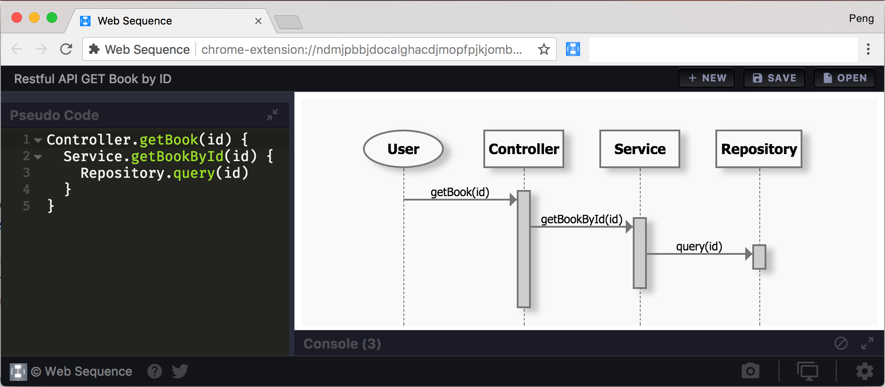

# Getting started

## What is Web Maker
**Web-Maker** is a chrome extension that converts your Chrome tab into a blazing fast & offline frontend playground for your web experiments.



## Features

* Supports Preprocessors: HTML (Pug & Markdown), CSS (SCSS, LESS & Stylus, Atomic CSS) & JavaScript (ES6, TypeScript & CoffeeScript)
* Works offline
* Inbuilt Console
* Save and load your creations
* Auto-save feature
* Code auto-completion
* Easy addition of popular JS & CSS libraries
* Import & Export all creations anytime, anywhere
* Multiple editor themes & other configurable settings
* Font options + use any system font!
* Very easily accessible. Simply open a new tab in Chrome!
* Multiple layouts to choose from
* Capture preview screenshot
* Save as HTML file
* Edit in CodePen

## Installation

If you haven't already installed Web Maker, you can do so from the [Chrome Web Store](https://chrome.google.com/webstore/detail/web-maker/lkfkkhfhhdkiemehlpkgjeojomhpccnh)

## Starting Web Maker

Once installed, you'll see a Web Maker icon in the right-top of your Chrome browser. Click it and Web Maker will open in a new tab.

By default, Web Maker shows up whatever was last open in it. But this behavior can be changed from [settings].

## Your first code

Okay, so now you might be wondering what do I do with Web Maker open in front of me? Wait no more! Simply put, Web Maker lets you write HTML, CSS & JavaScript code and see instant preview. So lets write some code.

You should be seeing 3 code panes with the headings: **HTML**, **CSS** and *JS*. Each code pane is dedicated place to write code in the respective languages. Go ahead and click inside the **HTML** code pane to focus it and then paste the following HTML code:

```html
<h1>My first HTML</h1>
```

As soon as you paste the code, you should see the preview of your HTML in the white preview area.


This is a very simple web page we just made. Going forward, you might need to put CSS and JavaScript too. You can write them in their respective code panes and see instant preview.

## A look at the user interface

Web Maker's user interface is made to feel simple and accessible so that you have all the required things at your tips and still doesn't look cluttered for someone using it for first time.

### Code Panes

Code panes are the actually sections where you write your code. You get 3 panes, one for HTML, CSS & JavaScript each.

### Preview

Alongside the code panes, is a white (by default) area where you see the preview of your code. Its an iframe that is feeded your HTML, CSS & JavaScript as you type to generate realtime preview.

### Title

On the top-left side you can see the title of your creation. Click on it to edit it anytime.

### Create New, Save or Open a creation

On the top-right side, you have the 3 buttons to create a new creation or save an open one. Also you can access all your saved creations from the *Saved Creations Pane* by clicking the *Open* button.

From the *Saved Creations Pane* you can also export or import all your creations at once. Exporting generates a JSON file which you can backup in your Google Drive, Dropbox etc.

### Settings

On the bottom right-most end you can access the app settings. Lots and lots of useful settings in there. To know in details about settings, [jump right here]().

### Changelog

Besides the Settings button, is the Changelog button where you can read all the changes in the app for each release version.

### Layouts

Next you have some layout options to choose from. Select whats suits you best. This setting is saved per creation basis, so each of your creation can show in a different layout that you see best for it.

### Export Item

Web Maker gives you quite some options to export your current creation to share with the world. You can save it as a single HTML file to upload it on a server, or open it in CodePen or take a screenshot of your preview.

### Help and Share

On the bottom-left side are few help options, one of which shows you all th keyboard shortcuts available inside the app. Also there is a tweet button you can use to share Web Maker with everyone :)

## Code panes

Coming soon...

## Pre-processors
Coming soon...

## Adding external libraries
Coming soon...

## Layouts
Coming soon...

## Keyboard shortcuts
Coming soon...

## Settings
Coming soon...

## Frequently Asked Questions
Coming soon...

## From the Developer

Hi! I am [Kushagra Gour](https://twitter.com/chinchang457), a frontend developer from India. I created Web Maker as a side project from myself because I wanted a frontend playground that was fast and didn't have to rely on network latency to generate realtime preview. Also something which I could use whenever and wherever I wanted, even wihtout Internet! I have written articles about why and how I created Web Maker and how you can benefit from it as a developer.

- FreeCodeCamp: https://medium.freecodecamp.org/web-maker-how-i-built-a-fast-offline-front-end-playground-9fe3629bc86f
- Sitepoint: https://www.sitepoint.com/web-maker-an-offline-browser-based-codepen-alternative/

Make sure to read them if you like to get more behind the scenes of my journey with Web Maker.

## Let's Talk

Want to send in some suggestions, comments, feature requests or just have a question? Here are your options:

- Twitter  — [ @webmakerApp](https://twitter.com/webmakerapp)
- [Gitter  chat]( http://gitter.im/web-maker-app/Lobby)
- [Github repository]( https://github.com/chinchang/web-maker/issues)